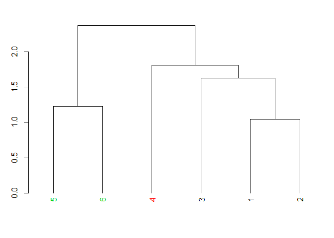
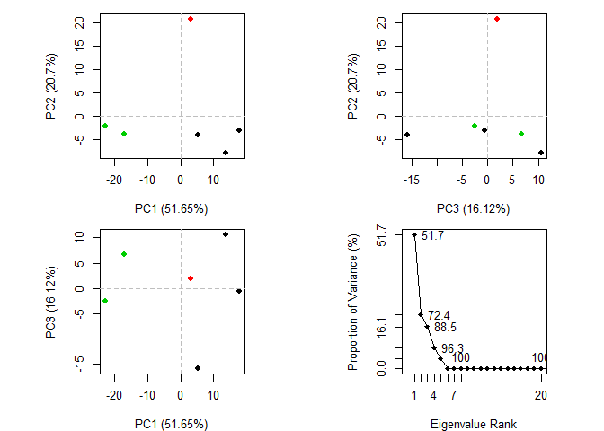
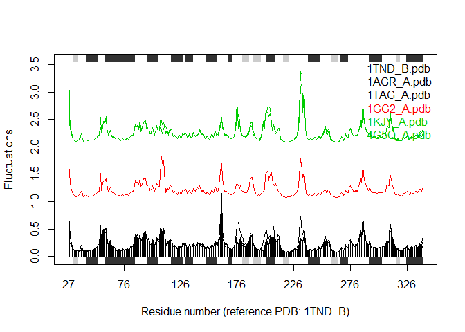

Wk6TuSec5
================
Yuya Zhao

GitHub Documents
----------------

This is an R Markdown format used for publishing markdown documents to GitHub. When you click the **Knit** button all R code chunks are run and a markdown file (.md) suitable for publishing to GitHub is generated.

Including Code
--------------

You can include R code in the document as follows:

``` r
#add package bio3d
library(bio3d)
# Download some example PDB files
ids <- c("1TND_B","1AGR_A","1TAG_A","1GG2_A","1KJY_A","4G5Q_A")
files <- get.pdb(ids, split = TRUE)
```

    ## Warning in get.pdb(ids, split = TRUE): ./1TND.pdb exists. Skipping download

    ## Warning in get.pdb(ids, split = TRUE): ./1AGR.pdb exists. Skipping download

    ## Warning in get.pdb(ids, split = TRUE): ./1TAG.pdb exists. Skipping download

    ## Warning in get.pdb(ids, split = TRUE): ./1GG2.pdb exists. Skipping download

    ## Warning in get.pdb(ids, split = TRUE): ./1KJY.pdb exists. Skipping download

    ## Warning in get.pdb(ids, split = TRUE): ./4G5Q.pdb exists. Skipping download

    ## 
      |                                                                       
      |                                                                 |   0%
      |                                                                       
      |===========                                                      |  17%
      |                                                                       
      |======================                                           |  33%
      |                                                                       
      |================================                                 |  50%
      |                                                                       
      |===========================================                      |  67%
      |                                                                       
      |======================================================           |  83%
      |                                                                       
      |=================================================================| 100%

``` r
# Extract and align the chains we are interested in
pdbs <- pdbaln(files, fit = TRUE)
```

    ## Reading PDB files:
    ## ./split_chain/1TND_B.pdb
    ## ./split_chain/1AGR_A.pdb
    ## ./split_chain/1TAG_A.pdb
    ## ./split_chain/1GG2_A.pdb
    ## ./split_chain/1KJY_A.pdb
    ## ./split_chain/4G5Q_A.pdb
    ## .....   PDB has ALT records, taking A only, rm.alt=TRUE
    ## .
    ## 
    ## Extracting sequences
    ## 
    ## pdb/seq: 1   name: ./split_chain/1TND_B.pdb 
    ## pdb/seq: 2   name: ./split_chain/1AGR_A.pdb 
    ## pdb/seq: 3   name: ./split_chain/1TAG_A.pdb 
    ## pdb/seq: 4   name: ./split_chain/1GG2_A.pdb 
    ## pdb/seq: 5   name: ./split_chain/1KJY_A.pdb 
    ## pdb/seq: 6   name: ./split_chain/4G5Q_A.pdb 
    ##    PDB has ALT records, taking A only, rm.alt=TRUE

``` r
# Print to screen a summary of the 'pdbs' object
pdbs
```

    ##                                1        .         .         .         .         50 
    ## [Truncated_Name:1]1TND_B.pdb   --------------------------ARTVKLLLLGAGESGKSTIVKQMK
    ## [Truncated_Name:2]1AGR_A.pdb   LSAEDKAAVERSKMIDRNLREDGEKAAREVKLLLLGAGESGKSTIVKQMK
    ## [Truncated_Name:3]1TAG_A.pdb   --------------------------ARTVKLLLLGAGESGKSTIVKQMK
    ## [Truncated_Name:4]1GG2_A.pdb   LSAEDKAAVERSKMIDRNLREDGEKAAREVKLLLLGAGESGKSTIVKQMK
    ## [Truncated_Name:5]1KJY_A.pdb   -------------------------GAREVKLLLLGAGESGKSTIVKQMK
    ## [Truncated_Name:6]4G5Q_A.pdb   --------------------------AREVKLLLLGAGESGKSTIVKQMK
    ##                                                          ** ********************* 
    ##                                1        .         .         .         .         50 
    ## 
    ##                               51        .         .         .         .         100 
    ## [Truncated_Name:1]1TND_B.pdb   IIHQDGYSLEECLEFIAIIYGNTLQSILAIVRAMTTLNIQYGDSARQDDA
    ## [Truncated_Name:2]1AGR_A.pdb   IIHEAGYSEEECKQYKAVVYSNTIQSIIAIIRAMGRLKIDFGDAARADDA
    ## [Truncated_Name:3]1TAG_A.pdb   IIHQDGYSLEECLEFIAIIYGNTLQSILAIVRAMTTLNIQYGDSARQDDA
    ## [Truncated_Name:4]1GG2_A.pdb   IIHEAGYSEEECKQYKAVVYSNTIQSIIAIIRAMGRLKIDFGDAARADDA
    ## [Truncated_Name:5]1KJY_A.pdb   IIHEAGYSEEECKQYKAVVYSNTIQSIIAIIRAMGRLKIDFGDSARADDA
    ## [Truncated_Name:6]4G5Q_A.pdb   IIHEAGYSEEECKQYKAVVYSNTIQSIIAIIRAMGRLKIDFGDSARADDA
    ##                                ***  *** ***  ^ *^^* **^***^**^***  * * ^** ** *** 
    ##                               51        .         .         .         .         100 
    ## 
    ##                              101        .         .         .         .         150 
    ## [Truncated_Name:1]1TND_B.pdb   RKLMHMADTIEEGTMPKEMSDIIQRLWKDSGIQACFDRASEYQLNDSAGY
    ## [Truncated_Name:2]1AGR_A.pdb   RQLFVLAGAAEEGFMTAELAGVIKRLWKDSGVQACFNRSREYQLNDSAAY
    ## [Truncated_Name:3]1TAG_A.pdb   RKLMHMADTIEEGTMPKEMSDIIQRLWKDSGIQACFDRASEYQLNDSAGY
    ## [Truncated_Name:4]1GG2_A.pdb   RQLFVLAGAAEEGFMTAELAGVIKRLWKDSGVQACFNRSREYQLNDSAAY
    ## [Truncated_Name:5]1KJY_A.pdb   RQLFVLAGAAEEGFMTAELAGVIKRLWKDSGVQACFNRSREYQLNDSAAY
    ## [Truncated_Name:6]4G5Q_A.pdb   RQLFVLAGAAEEGFMTAELAGVIKRLWKDSGVQACFNRSREYQLNDSAAY
    ##                                * *  ^*   *** *  *^  ^* *******^**** *  ********^* 
    ##                              101        .         .         .         .         150 
    ## 
    ##                              151        .         .         .         .         200 
    ## [Truncated_Name:1]1TND_B.pdb   YLSDLERLVTPGYVPTEQDVLRSRVKTTGIIETQFSFKDLNFRMFDVGGQ
    ## [Truncated_Name:2]1AGR_A.pdb   YLNDLDRIAQPNYIPTQQDVLRTRVKTTGIVETHFTFKDLHFKMFDVGGQ
    ## [Truncated_Name:3]1TAG_A.pdb   YLSDLERLVTPGYVPTEQDVLRSRVKTTGIIETQFSFKDLNFRMFDVGGQ
    ## [Truncated_Name:4]1GG2_A.pdb   YLNDLDRIAQPNYIPTQQDVLRTRVKTTGIVETHFTFKDLHFKMFDVGAQ
    ## [Truncated_Name:5]1KJY_A.pdb   YLNDLDRIAQPNYIPTQQDVLRTRVKTTGIVETHFTFKDLHFKMFDVGGQ
    ## [Truncated_Name:6]4G5Q_A.pdb   YLNDLDRIAQPNYIPTQQDVLRTRVKTTGIVETHFTFKDLHFKMFDVGGQ
    ##                                ** **^*^  * *^** *****^*******^** *^**** *^*****^* 
    ##                              151        .         .         .         .         200 
    ## 
    ##                              201        .         .         .         .         250 
    ## [Truncated_Name:1]1TND_B.pdb   RSERKKWIHCFEGVTCIIFIAALSAYDMVLVEDDEVNRMHESLHLFNSIC
    ## [Truncated_Name:2]1AGR_A.pdb   RSERKKWIHCFEGVTAIIFCVALSDYDLVLAEDEEMNRMHESMKLFDSIC
    ## [Truncated_Name:3]1TAG_A.pdb   RSERKKWIHCFEGVTCIIFIAALSAYDMVLVEDDEVNRMHESLHLFNSIC
    ## [Truncated_Name:4]1GG2_A.pdb   RSERKKWIHCFEGVTAIIFCVALSDYDLVLAEDEEMNRMHESMKLFDSIC
    ## [Truncated_Name:5]1KJY_A.pdb   RSERKKWIHCFEGVTAIIFCVALSDYDLVLAEDEEMNRMHESMKLFDSIC
    ## [Truncated_Name:6]4G5Q_A.pdb   RSERKKWIHCFEGVTAIIFCVALSDYDLVLAEDEEMNRMHESMKLFDSIC
    ##                                *************** ***  *** **^** **^*^******^^** *** 
    ##                              201        .         .         .         .         250 
    ## 
    ##                              251        .         .         .         .         300 
    ## [Truncated_Name:1]1TND_B.pdb   NHRYFATTSIVLFLNKKDVFSEKIKKAHLSICFPDYNGPNTYEDAGNYIK
    ## [Truncated_Name:2]1AGR_A.pdb   NNKWFTDTSIILFLNKKDLFEEKIKKSPLTICYPEYAGSNTYEEAAAYIQ
    ## [Truncated_Name:3]1TAG_A.pdb   NHRYFATTSIVLFLNKKDVFSEKIKKAHLSICFPDYNGPNTYEDAGNYIK
    ## [Truncated_Name:4]1GG2_A.pdb   NNKWFTDTSIILFLNKKDLFEEKIKKSPLTICYPEYAGSNTYEEAAAYIQ
    ## [Truncated_Name:5]1KJY_A.pdb   NNKWFTDTSIILFLNKKDLFEEKIKKSPLTICYPEYAGSNTYEEAAAYIQ
    ## [Truncated_Name:6]4G5Q_A.pdb   NNKWFTDTSIILFLNKKDLFEEKIKKSPLTICYPEYAGSNTYEEAAAYIQ
    ##                                * ^^*  ***^*******^* *****  *^**^*^* * ****^*^ **  
    ##                              251        .         .         .         .         300 
    ## 
    ##                              301        .         .         .         .         350 
    ## [Truncated_Name:1]1TND_B.pdb   VQFLELNMRRDVKEIYSHMTCATDTQNVKFVFDAVTDIIIKE--------
    ## [Truncated_Name:2]1AGR_A.pdb   CQFEDLNKRKDTKEIYTHFTCATDTKNVQFVFDAVTDVIIKNNLKDCGLF
    ## [Truncated_Name:3]1TAG_A.pdb   VQFLELNMRRDVKEIYSHMTCATDTQNVKFVFDAVTDIII----------
    ## [Truncated_Name:4]1GG2_A.pdb   CQFEDLNKRKDTKEIYTHFTCATDTKNVQFVFDAVTDVIIKNNL------
    ## [Truncated_Name:5]1KJY_A.pdb   CQFEDLNKRKDTKEIYTHFTCATDTKNVQFVFDAVTDVIIKNNLK-----
    ## [Truncated_Name:6]4G5Q_A.pdb   CQFEDLNKRKDTKEIYTHFTCATDTKNVQFVFDAVTDVIIKNNLKD----
    ##                                 ** ^** *^* ****^* ****** ** ********^**           
    ##                              301        .         .         .         .         350 
    ## 
    ## Call:
    ##   pdbaln(files = files, fit = TRUE)
    ## 
    ## Class:
    ##   pdbs, fasta
    ## 
    ## Alignment dimensions:
    ##   6 sequence rows; 350 position columns (314 non-gap, 36 gap) 
    ## 
    ## + attr: xyz, resno, b, chain, id, ali, resid, sse, call

    ##                          [,1] [,2] [,3] [,4] [,5] [,6] [,7] [,8]
    ## ./split_chain/1TND_B.pdb "-"  "-"  "-"  "-"  "-"  "-"  "-"  "-" 
    ## ./split_chain/1AGR_A.pdb "L"  "S"  "A"  "E"  "D"  "K"  "A"  "A" 
    ## ./split_chain/1TAG_A.pdb "-"  "-"  "-"  "-"  "-"  "-"  "-"  "-" 
    ## ./split_chain/1GG2_A.pdb "L"  "S"  "A"  "E"  "D"  "K"  "A"  "A" 
    ## ./split_chain/1KJY_A.pdb "-"  "-"  "-"  "-"  "-"  "-"  "-"  "-"

    ##                          [,1] [,2] [,3] [,4] [,5] [,6] [,7] [,8]
    ## ./split_chain/1TND_B.pdb   NA   NA   NA   NA   NA   NA   NA   NA
    ## ./split_chain/1AGR_A.pdb    5    6    7    8    9   10   11   12
    ## ./split_chain/1TAG_A.pdb   NA   NA   NA   NA   NA   NA   NA   NA
    ## ./split_chain/1GG2_A.pdb    5    6    7    8    9   10   11   12
    ## ./split_chain/1KJY_A.pdb   NA   NA   NA   NA   NA   NA   NA   NA

    ## [1] 27 28 29 30 31 32

    ##                          [,1] [,2] [,3] [,4] [,5] [,6] [,7] [,8] [,9]
    ## ./split_chain/1TND_B.pdb "A"  "R"  "T"  "V"  "K"  "L"  "L"  "L"  "L" 
    ## ./split_chain/1AGR_A.pdb "A"  "R"  "E"  "V"  "K"  "L"  "L"  "L"  "L" 
    ## ./split_chain/1TAG_A.pdb "A"  "R"  "T"  "V"  "K"  "L"  "L"  "L"  "L" 
    ## ./split_chain/1GG2_A.pdb "A"  "R"  "E"  "V"  "K"  "L"  "L"  "L"  "L" 
    ## ./split_chain/1KJY_A.pdb "A"  "R"  "E"  "V"  "K"  "L"  "L"  "L"  "L" 
    ## ./split_chain/4G5Q_A.pdb "A"  "R"  "E"  "V"  "K"  "L"  "L"  "L"  "L" 
    ##                          [,10] [,11] [,12] [,13] [,14] [,15] [,16] [,17]
    ## ./split_chain/1TND_B.pdb "G"   "A"   "G"   "E"   "S"   "G"   "K"   "S"  
    ## ./split_chain/1AGR_A.pdb "G"   "A"   "G"   "E"   "S"   "G"   "K"   "S"  
    ## ./split_chain/1TAG_A.pdb "G"   "A"   "G"   "E"   "S"   "G"   "K"   "S"  
    ## ./split_chain/1GG2_A.pdb "G"   "A"   "G"   "E"   "S"   "G"   "K"   "S"  
    ## ./split_chain/1KJY_A.pdb "G"   "A"   "G"   "E"   "S"   "G"   "K"   "S"  
    ## ./split_chain/4G5Q_A.pdb "G"   "A"   "G"   "E"   "S"   "G"   "K"   "S"  
    ##                          [,18] [,19] [,20] [,21] [,22] [,23] [,24] [,25]
    ## ./split_chain/1TND_B.pdb "T"   "I"   "V"   "K"   "Q"   "M"   "K"   "I"  
    ## ./split_chain/1AGR_A.pdb "T"   "I"   "V"   "K"   "Q"   "M"   "K"   "I"  
    ## ./split_chain/1TAG_A.pdb "T"   "I"   "V"   "K"   "Q"   "M"   "K"   "I"  
    ## ./split_chain/1GG2_A.pdb "T"   "I"   "V"   "K"   "Q"   "M"   "K"   "I"  
    ## ./split_chain/1KJY_A.pdb "T"   "I"   "V"   "K"   "Q"   "M"   "K"   "I"  
    ## ./split_chain/4G5Q_A.pdb "T"   "I"   "V"   "K"   "Q"   "M"   "K"   "I"  
    ##                          [,26] [,27] [,28] [,29] [,30] [,31] [,32] [,33]
    ## ./split_chain/1TND_B.pdb "I"   "H"   "Q"   "D"   "G"   "Y"   "S"   "L"  
    ## ./split_chain/1AGR_A.pdb "I"   "H"   "E"   "A"   "G"   "Y"   "S"   "E"  
    ## ./split_chain/1TAG_A.pdb "I"   "H"   "Q"   "D"   "G"   "Y"   "S"   "L"  
    ## ./split_chain/1GG2_A.pdb "I"   "H"   "E"   "A"   "G"   "Y"   "S"   "E"  
    ## ./split_chain/1KJY_A.pdb "I"   "H"   "E"   "A"   "G"   "Y"   "S"   "E"  
    ## ./split_chain/4G5Q_A.pdb "I"   "H"   "E"   "A"   "G"   "Y"   "S"   "E"  
    ##                          [,34] [,35] [,36] [,37] [,38] [,39] [,40] [,41]
    ## ./split_chain/1TND_B.pdb "E"   "E"   "C"   "L"   "E"   "F"   "I"   "A"  
    ## ./split_chain/1AGR_A.pdb "E"   "E"   "C"   "K"   "Q"   "Y"   "K"   "A"  
    ## ./split_chain/1TAG_A.pdb "E"   "E"   "C"   "L"   "E"   "F"   "I"   "A"  
    ## ./split_chain/1GG2_A.pdb "E"   "E"   "C"   "K"   "Q"   "Y"   "K"   "A"  
    ## ./split_chain/1KJY_A.pdb "E"   "E"   "C"   "K"   "Q"   "Y"   "K"   "A"  
    ## ./split_chain/4G5Q_A.pdb "E"   "E"   "C"   "K"   "Q"   "Y"   "K"   "A"  
    ##                          [,42] [,43] [,44] [,45] [,46] [,47] [,48] [,49]
    ## ./split_chain/1TND_B.pdb "I"   "I"   "Y"   "G"   "N"   "T"   "L"   "Q"  
    ## ./split_chain/1AGR_A.pdb "V"   "V"   "Y"   "S"   "N"   "T"   "I"   "Q"  
    ## ./split_chain/1TAG_A.pdb "I"   "I"   "Y"   "G"   "N"   "T"   "L"   "Q"  
    ## ./split_chain/1GG2_A.pdb "V"   "V"   "Y"   "S"   "N"   "T"   "I"   "Q"  
    ## ./split_chain/1KJY_A.pdb "V"   "V"   "Y"   "S"   "N"   "T"   "I"   "Q"  
    ## ./split_chain/4G5Q_A.pdb "V"   "V"   "Y"   "S"   "N"   "T"   "I"   "Q"  
    ##                          [,50] [,51] [,52] [,53] [,54] [,55] [,56] [,57]
    ## ./split_chain/1TND_B.pdb "S"   "I"   "L"   "A"   "I"   "V"   "R"   "A"  
    ## ./split_chain/1AGR_A.pdb "S"   "I"   "I"   "A"   "I"   "I"   "R"   "A"  
    ## ./split_chain/1TAG_A.pdb "S"   "I"   "L"   "A"   "I"   "V"   "R"   "A"  
    ## ./split_chain/1GG2_A.pdb "S"   "I"   "I"   "A"   "I"   "I"   "R"   "A"  
    ## ./split_chain/1KJY_A.pdb "S"   "I"   "I"   "A"   "I"   "I"   "R"   "A"  
    ## ./split_chain/4G5Q_A.pdb "S"   "I"   "I"   "A"   "I"   "I"   "R"   "A"  
    ##                          [,58] [,59] [,60] [,61] [,62] [,63] [,64] [,65]
    ## ./split_chain/1TND_B.pdb "M"   "T"   "T"   "L"   "N"   "I"   "Q"   "Y"  
    ## ./split_chain/1AGR_A.pdb "M"   "G"   "R"   "L"   "K"   "I"   "D"   "F"  
    ## ./split_chain/1TAG_A.pdb "M"   "T"   "T"   "L"   "N"   "I"   "Q"   "Y"  
    ## ./split_chain/1GG2_A.pdb "M"   "G"   "R"   "L"   "K"   "I"   "D"   "F"  
    ## ./split_chain/1KJY_A.pdb "M"   "G"   "R"   "L"   "K"   "I"   "D"   "F"  
    ## ./split_chain/4G5Q_A.pdb "M"   "G"   "R"   "L"   "K"   "I"   "D"   "F"  
    ##                          [,66] [,67] [,68] [,69] [,70] [,71] [,72] [,73]
    ## ./split_chain/1TND_B.pdb "G"   "D"   "S"   "A"   "R"   "Q"   "D"   "D"  
    ## ./split_chain/1AGR_A.pdb "G"   "D"   "A"   "A"   "R"   "A"   "D"   "D"  
    ## ./split_chain/1TAG_A.pdb "G"   "D"   "S"   "A"   "R"   "Q"   "D"   "D"  
    ## ./split_chain/1GG2_A.pdb "G"   "D"   "A"   "A"   "R"   "A"   "D"   "D"  
    ## ./split_chain/1KJY_A.pdb "G"   "D"   "S"   "A"   "R"   "A"   "D"   "D"  
    ## ./split_chain/4G5Q_A.pdb "G"   "D"   "S"   "A"   "R"   "A"   "D"   "D"  
    ##                          [,74] [,75] [,76] [,77] [,78] [,79] [,80] [,81]
    ## ./split_chain/1TND_B.pdb "A"   "R"   "K"   "L"   "M"   "H"   "M"   "A"  
    ## ./split_chain/1AGR_A.pdb "A"   "R"   "Q"   "L"   "F"   "V"   "L"   "A"  
    ## ./split_chain/1TAG_A.pdb "A"   "R"   "K"   "L"   "M"   "H"   "M"   "A"  
    ## ./split_chain/1GG2_A.pdb "A"   "R"   "Q"   "L"   "F"   "V"   "L"   "A"  
    ## ./split_chain/1KJY_A.pdb "A"   "R"   "Q"   "L"   "F"   "V"   "L"   "A"  
    ## ./split_chain/4G5Q_A.pdb "A"   "R"   "Q"   "L"   "F"   "V"   "L"   "A"  
    ##                          [,82] [,83] [,84] [,85] [,86] [,87] [,88] [,89]
    ## ./split_chain/1TND_B.pdb "D"   "T"   "I"   "E"   "E"   "G"   "T"   "M"  
    ## ./split_chain/1AGR_A.pdb "G"   "A"   "A"   "E"   "E"   "G"   "F"   "M"  
    ## ./split_chain/1TAG_A.pdb "D"   "T"   "I"   "E"   "E"   "G"   "T"   "M"  
    ## ./split_chain/1GG2_A.pdb "G"   "A"   "A"   "E"   "E"   "G"   "F"   "M"  
    ## ./split_chain/1KJY_A.pdb "G"   "A"   "A"   "E"   "E"   "G"   "F"   "M"  
    ## ./split_chain/4G5Q_A.pdb "G"   "A"   "A"   "E"   "E"   "G"   "F"   "M"  
    ##                          [,90] [,91] [,92] [,93] [,94] [,95] [,96] [,97]
    ## ./split_chain/1TND_B.pdb "P"   "K"   "E"   "M"   "S"   "D"   "I"   "I"  
    ## ./split_chain/1AGR_A.pdb "T"   "A"   "E"   "L"   "A"   "G"   "V"   "I"  
    ## ./split_chain/1TAG_A.pdb "P"   "K"   "E"   "M"   "S"   "D"   "I"   "I"  
    ## ./split_chain/1GG2_A.pdb "T"   "A"   "E"   "L"   "A"   "G"   "V"   "I"  
    ## ./split_chain/1KJY_A.pdb "T"   "A"   "E"   "L"   "A"   "G"   "V"   "I"  
    ## ./split_chain/4G5Q_A.pdb "T"   "A"   "E"   "L"   "A"   "G"   "V"   "I"  
    ##                          [,98] [,99] [,100] [,101] [,102] [,103] [,104]
    ## ./split_chain/1TND_B.pdb "Q"   "R"   "L"    "W"    "K"    "D"    "S"   
    ## ./split_chain/1AGR_A.pdb "K"   "R"   "L"    "W"    "K"    "D"    "S"   
    ## ./split_chain/1TAG_A.pdb "Q"   "R"   "L"    "W"    "K"    "D"    "S"   
    ## ./split_chain/1GG2_A.pdb "K"   "R"   "L"    "W"    "K"    "D"    "S"   
    ## ./split_chain/1KJY_A.pdb "K"   "R"   "L"    "W"    "K"    "D"    "S"   
    ## ./split_chain/4G5Q_A.pdb "K"   "R"   "L"    "W"    "K"    "D"    "S"   
    ##                          [,105] [,106] [,107] [,108] [,109] [,110] [,111]
    ## ./split_chain/1TND_B.pdb "G"    "I"    "Q"    "A"    "C"    "F"    "D"   
    ## ./split_chain/1AGR_A.pdb "G"    "V"    "Q"    "A"    "C"    "F"    "N"   
    ## ./split_chain/1TAG_A.pdb "G"    "I"    "Q"    "A"    "C"    "F"    "D"   
    ## ./split_chain/1GG2_A.pdb "G"    "V"    "Q"    "A"    "C"    "F"    "N"   
    ## ./split_chain/1KJY_A.pdb "G"    "V"    "Q"    "A"    "C"    "F"    "N"   
    ## ./split_chain/4G5Q_A.pdb "G"    "V"    "Q"    "A"    "C"    "F"    "N"   
    ##                          [,112] [,113] [,114] [,115] [,116] [,117] [,118]
    ## ./split_chain/1TND_B.pdb "R"    "A"    "S"    "E"    "Y"    "Q"    "L"   
    ## ./split_chain/1AGR_A.pdb "R"    "S"    "R"    "E"    "Y"    "Q"    "L"   
    ## ./split_chain/1TAG_A.pdb "R"    "A"    "S"    "E"    "Y"    "Q"    "L"   
    ## ./split_chain/1GG2_A.pdb "R"    "S"    "R"    "E"    "Y"    "Q"    "L"   
    ## ./split_chain/1KJY_A.pdb "R"    "S"    "R"    "E"    "Y"    "Q"    "L"   
    ## ./split_chain/4G5Q_A.pdb "R"    "S"    "R"    "E"    "Y"    "Q"    "L"   
    ##                          [,119] [,120] [,121] [,122] [,123] [,124] [,125]
    ## ./split_chain/1TND_B.pdb "N"    "D"    "S"    "A"    "G"    "Y"    "Y"   
    ## ./split_chain/1AGR_A.pdb "N"    "D"    "S"    "A"    "A"    "Y"    "Y"   
    ## ./split_chain/1TAG_A.pdb "N"    "D"    "S"    "A"    "G"    "Y"    "Y"   
    ## ./split_chain/1GG2_A.pdb "N"    "D"    "S"    "A"    "A"    "Y"    "Y"   
    ## ./split_chain/1KJY_A.pdb "N"    "D"    "S"    "A"    "A"    "Y"    "Y"   
    ## ./split_chain/4G5Q_A.pdb "N"    "D"    "S"    "A"    "A"    "Y"    "Y"   
    ##                          [,126] [,127] [,128] [,129] [,130] [,131] [,132]
    ## ./split_chain/1TND_B.pdb "L"    "S"    "D"    "L"    "E"    "R"    "L"   
    ## ./split_chain/1AGR_A.pdb "L"    "N"    "D"    "L"    "D"    "R"    "I"   
    ## ./split_chain/1TAG_A.pdb "L"    "S"    "D"    "L"    "E"    "R"    "L"   
    ## ./split_chain/1GG2_A.pdb "L"    "N"    "D"    "L"    "D"    "R"    "I"   
    ## ./split_chain/1KJY_A.pdb "L"    "N"    "D"    "L"    "D"    "R"    "I"   
    ## ./split_chain/4G5Q_A.pdb "L"    "N"    "D"    "L"    "D"    "R"    "I"   
    ##                          [,133] [,134] [,135] [,136] [,137] [,138] [,139]
    ## ./split_chain/1TND_B.pdb "V"    "T"    "P"    "G"    "Y"    "V"    "P"   
    ## ./split_chain/1AGR_A.pdb "A"    "Q"    "P"    "N"    "Y"    "I"    "P"   
    ## ./split_chain/1TAG_A.pdb "V"    "T"    "P"    "G"    "Y"    "V"    "P"   
    ## ./split_chain/1GG2_A.pdb "A"    "Q"    "P"    "N"    "Y"    "I"    "P"   
    ## ./split_chain/1KJY_A.pdb "A"    "Q"    "P"    "N"    "Y"    "I"    "P"   
    ## ./split_chain/4G5Q_A.pdb "A"    "Q"    "P"    "N"    "Y"    "I"    "P"   
    ##                          [,140] [,141] [,142] [,143] [,144] [,145] [,146]
    ## ./split_chain/1TND_B.pdb "T"    "E"    "Q"    "D"    "V"    "L"    "R"   
    ## ./split_chain/1AGR_A.pdb "T"    "Q"    "Q"    "D"    "V"    "L"    "R"   
    ## ./split_chain/1TAG_A.pdb "T"    "E"    "Q"    "D"    "V"    "L"    "R"   
    ## ./split_chain/1GG2_A.pdb "T"    "Q"    "Q"    "D"    "V"    "L"    "R"   
    ## ./split_chain/1KJY_A.pdb "T"    "Q"    "Q"    "D"    "V"    "L"    "R"   
    ## ./split_chain/4G5Q_A.pdb "T"    "Q"    "Q"    "D"    "V"    "L"    "R"   
    ##                          [,147] [,148] [,149] [,150] [,151] [,152] [,153]
    ## ./split_chain/1TND_B.pdb "S"    "R"    "V"    "K"    "T"    "T"    "G"   
    ## ./split_chain/1AGR_A.pdb "T"    "R"    "V"    "K"    "T"    "T"    "G"   
    ## ./split_chain/1TAG_A.pdb "S"    "R"    "V"    "K"    "T"    "T"    "G"   
    ## ./split_chain/1GG2_A.pdb "T"    "R"    "V"    "K"    "T"    "T"    "G"   
    ## ./split_chain/1KJY_A.pdb "T"    "R"    "V"    "K"    "T"    "T"    "G"   
    ## ./split_chain/4G5Q_A.pdb "T"    "R"    "V"    "K"    "T"    "T"    "G"   
    ##                          [,154] [,155] [,156] [,157] [,158] [,159] [,160]
    ## ./split_chain/1TND_B.pdb "I"    "I"    "E"    "T"    "Q"    "F"    "S"   
    ## ./split_chain/1AGR_A.pdb "I"    "V"    "E"    "T"    "H"    "F"    "T"   
    ## ./split_chain/1TAG_A.pdb "I"    "I"    "E"    "T"    "Q"    "F"    "S"   
    ## ./split_chain/1GG2_A.pdb "I"    "V"    "E"    "T"    "H"    "F"    "T"   
    ## ./split_chain/1KJY_A.pdb "I"    "V"    "E"    "T"    "H"    "F"    "T"   
    ## ./split_chain/4G5Q_A.pdb "I"    "V"    "E"    "T"    "H"    "F"    "T"   
    ##                          [,161] [,162] [,163] [,164] [,165] [,166] [,167]
    ## ./split_chain/1TND_B.pdb "F"    "K"    "D"    "L"    "N"    "F"    "R"   
    ## ./split_chain/1AGR_A.pdb "F"    "K"    "D"    "L"    "H"    "F"    "K"   
    ## ./split_chain/1TAG_A.pdb "F"    "K"    "D"    "L"    "N"    "F"    "R"   
    ## ./split_chain/1GG2_A.pdb "F"    "K"    "D"    "L"    "H"    "F"    "K"   
    ## ./split_chain/1KJY_A.pdb "F"    "K"    "D"    "L"    "H"    "F"    "K"   
    ## ./split_chain/4G5Q_A.pdb "F"    "K"    "D"    "L"    "H"    "F"    "K"   
    ##                          [,168] [,169] [,170] [,171] [,172] [,173] [,174]
    ## ./split_chain/1TND_B.pdb "M"    "F"    "D"    "V"    "G"    "G"    "Q"   
    ## ./split_chain/1AGR_A.pdb "M"    "F"    "D"    "V"    "G"    "G"    "Q"   
    ## ./split_chain/1TAG_A.pdb "M"    "F"    "D"    "V"    "G"    "G"    "Q"   
    ## ./split_chain/1GG2_A.pdb "M"    "F"    "D"    "V"    "G"    "A"    "Q"   
    ## ./split_chain/1KJY_A.pdb "M"    "F"    "D"    "V"    "G"    "G"    "Q"   
    ## ./split_chain/4G5Q_A.pdb "M"    "F"    "D"    "V"    "G"    "G"    "Q"   
    ##                          [,175] [,176] [,177] [,178] [,179] [,180] [,181]
    ## ./split_chain/1TND_B.pdb "R"    "S"    "E"    "R"    "K"    "K"    "W"   
    ## ./split_chain/1AGR_A.pdb "R"    "S"    "E"    "R"    "K"    "K"    "W"   
    ## ./split_chain/1TAG_A.pdb "R"    "S"    "E"    "R"    "K"    "K"    "W"   
    ## ./split_chain/1GG2_A.pdb "R"    "S"    "E"    "R"    "K"    "K"    "W"   
    ## ./split_chain/1KJY_A.pdb "R"    "S"    "E"    "R"    "K"    "K"    "W"   
    ## ./split_chain/4G5Q_A.pdb "R"    "S"    "E"    "R"    "K"    "K"    "W"   
    ##                          [,182] [,183] [,184] [,185] [,186] [,187] [,188]
    ## ./split_chain/1TND_B.pdb "I"    "H"    "C"    "F"    "E"    "G"    "V"   
    ## ./split_chain/1AGR_A.pdb "I"    "H"    "C"    "F"    "E"    "G"    "V"   
    ## ./split_chain/1TAG_A.pdb "I"    "H"    "C"    "F"    "E"    "G"    "V"   
    ## ./split_chain/1GG2_A.pdb "I"    "H"    "C"    "F"    "E"    "G"    "V"   
    ## ./split_chain/1KJY_A.pdb "I"    "H"    "C"    "F"    "E"    "G"    "V"   
    ## ./split_chain/4G5Q_A.pdb "I"    "H"    "C"    "F"    "E"    "G"    "V"   
    ##                          [,189] [,190] [,191] [,192] [,193] [,194] [,195]
    ## ./split_chain/1TND_B.pdb "T"    "C"    "I"    "I"    "F"    "I"    "A"   
    ## ./split_chain/1AGR_A.pdb "T"    "A"    "I"    "I"    "F"    "C"    "V"   
    ## ./split_chain/1TAG_A.pdb "T"    "C"    "I"    "I"    "F"    "I"    "A"   
    ## ./split_chain/1GG2_A.pdb "T"    "A"    "I"    "I"    "F"    "C"    "V"   
    ## ./split_chain/1KJY_A.pdb "T"    "A"    "I"    "I"    "F"    "C"    "V"   
    ## ./split_chain/4G5Q_A.pdb "T"    "A"    "I"    "I"    "F"    "C"    "V"   
    ##                          [,196] [,197] [,198] [,199] [,200] [,201] [,202]
    ## ./split_chain/1TND_B.pdb "A"    "L"    "S"    "A"    "Y"    "D"    "M"   
    ## ./split_chain/1AGR_A.pdb "A"    "L"    "S"    "D"    "Y"    "D"    "L"   
    ## ./split_chain/1TAG_A.pdb "A"    "L"    "S"    "A"    "Y"    "D"    "M"   
    ## ./split_chain/1GG2_A.pdb "A"    "L"    "S"    "D"    "Y"    "D"    "L"   
    ## ./split_chain/1KJY_A.pdb "A"    "L"    "S"    "D"    "Y"    "D"    "L"   
    ## ./split_chain/4G5Q_A.pdb "A"    "L"    "S"    "D"    "Y"    "D"    "L"   
    ##                          [,203] [,204] [,205] [,206] [,207] [,208] [,209]
    ## ./split_chain/1TND_B.pdb "V"    "L"    "V"    "E"    "D"    "D"    "E"   
    ## ./split_chain/1AGR_A.pdb "V"    "L"    "A"    "E"    "D"    "E"    "E"   
    ## ./split_chain/1TAG_A.pdb "V"    "L"    "V"    "E"    "D"    "D"    "E"   
    ## ./split_chain/1GG2_A.pdb "V"    "L"    "A"    "E"    "D"    "E"    "E"   
    ## ./split_chain/1KJY_A.pdb "V"    "L"    "A"    "E"    "D"    "E"    "E"   
    ## ./split_chain/4G5Q_A.pdb "V"    "L"    "A"    "E"    "D"    "E"    "E"   
    ##                          [,210] [,211] [,212] [,213] [,214] [,215] [,216]
    ## ./split_chain/1TND_B.pdb "V"    "N"    "R"    "M"    "H"    "E"    "S"   
    ## ./split_chain/1AGR_A.pdb "M"    "N"    "R"    "M"    "H"    "E"    "S"   
    ## ./split_chain/1TAG_A.pdb "V"    "N"    "R"    "M"    "H"    "E"    "S"   
    ## ./split_chain/1GG2_A.pdb "M"    "N"    "R"    "M"    "H"    "E"    "S"   
    ## ./split_chain/1KJY_A.pdb "M"    "N"    "R"    "M"    "H"    "E"    "S"   
    ## ./split_chain/4G5Q_A.pdb "M"    "N"    "R"    "M"    "H"    "E"    "S"   
    ##                          [,217] [,218] [,219] [,220] [,221] [,222] [,223]
    ## ./split_chain/1TND_B.pdb "L"    "H"    "L"    "F"    "N"    "S"    "I"   
    ## ./split_chain/1AGR_A.pdb "M"    "K"    "L"    "F"    "D"    "S"    "I"   
    ## ./split_chain/1TAG_A.pdb "L"    "H"    "L"    "F"    "N"    "S"    "I"   
    ## ./split_chain/1GG2_A.pdb "M"    "K"    "L"    "F"    "D"    "S"    "I"   
    ## ./split_chain/1KJY_A.pdb "M"    "K"    "L"    "F"    "D"    "S"    "I"   
    ## ./split_chain/4G5Q_A.pdb "M"    "K"    "L"    "F"    "D"    "S"    "I"   
    ##                          [,224] [,225] [,226] [,227] [,228] [,229] [,230]
    ## ./split_chain/1TND_B.pdb "C"    "N"    "H"    "R"    "Y"    "F"    "A"   
    ## ./split_chain/1AGR_A.pdb "C"    "N"    "N"    "K"    "W"    "F"    "T"   
    ## ./split_chain/1TAG_A.pdb "C"    "N"    "H"    "R"    "Y"    "F"    "A"   
    ## ./split_chain/1GG2_A.pdb "C"    "N"    "N"    "K"    "W"    "F"    "T"   
    ## ./split_chain/1KJY_A.pdb "C"    "N"    "N"    "K"    "W"    "F"    "T"   
    ## ./split_chain/4G5Q_A.pdb "C"    "N"    "N"    "K"    "W"    "F"    "T"   
    ##                          [,231] [,232] [,233] [,234] [,235] [,236] [,237]
    ## ./split_chain/1TND_B.pdb "T"    "T"    "S"    "I"    "V"    "L"    "F"   
    ## ./split_chain/1AGR_A.pdb "D"    "T"    "S"    "I"    "I"    "L"    "F"   
    ## ./split_chain/1TAG_A.pdb "T"    "T"    "S"    "I"    "V"    "L"    "F"   
    ## ./split_chain/1GG2_A.pdb "D"    "T"    "S"    "I"    "I"    "L"    "F"   
    ## ./split_chain/1KJY_A.pdb "D"    "T"    "S"    "I"    "I"    "L"    "F"   
    ## ./split_chain/4G5Q_A.pdb "D"    "T"    "S"    "I"    "I"    "L"    "F"   
    ##                          [,238] [,239] [,240] [,241] [,242] [,243] [,244]
    ## ./split_chain/1TND_B.pdb "L"    "N"    "K"    "K"    "D"    "V"    "F"   
    ## ./split_chain/1AGR_A.pdb "L"    "N"    "K"    "K"    "D"    "L"    "F"   
    ## ./split_chain/1TAG_A.pdb "L"    "N"    "K"    "K"    "D"    "V"    "F"   
    ## ./split_chain/1GG2_A.pdb "L"    "N"    "K"    "K"    "D"    "L"    "F"   
    ## ./split_chain/1KJY_A.pdb "L"    "N"    "K"    "K"    "D"    "L"    "F"   
    ## ./split_chain/4G5Q_A.pdb "L"    "N"    "K"    "K"    "D"    "L"    "F"   
    ##                          [,245] [,246] [,247] [,248] [,249] [,250] [,251]
    ## ./split_chain/1TND_B.pdb "S"    "E"    "K"    "I"    "K"    "K"    "A"   
    ## ./split_chain/1AGR_A.pdb "E"    "E"    "K"    "I"    "K"    "K"    "S"   
    ## ./split_chain/1TAG_A.pdb "S"    "E"    "K"    "I"    "K"    "K"    "A"   
    ## ./split_chain/1GG2_A.pdb "E"    "E"    "K"    "I"    "K"    "K"    "S"   
    ## ./split_chain/1KJY_A.pdb "E"    "E"    "K"    "I"    "K"    "K"    "S"   
    ## ./split_chain/4G5Q_A.pdb "E"    "E"    "K"    "I"    "K"    "K"    "S"   
    ##                          [,252] [,253] [,254] [,255] [,256] [,257] [,258]
    ## ./split_chain/1TND_B.pdb "H"    "L"    "S"    "I"    "C"    "F"    "P"   
    ## ./split_chain/1AGR_A.pdb "P"    "L"    "T"    "I"    "C"    "Y"    "P"   
    ## ./split_chain/1TAG_A.pdb "H"    "L"    "S"    "I"    "C"    "F"    "P"   
    ## ./split_chain/1GG2_A.pdb "P"    "L"    "T"    "I"    "C"    "Y"    "P"   
    ## ./split_chain/1KJY_A.pdb "P"    "L"    "T"    "I"    "C"    "Y"    "P"   
    ## ./split_chain/4G5Q_A.pdb "P"    "L"    "T"    "I"    "C"    "Y"    "P"   
    ##                          [,259] [,260] [,261] [,262] [,263] [,264] [,265]
    ## ./split_chain/1TND_B.pdb "D"    "Y"    "N"    "G"    "P"    "N"    "T"   
    ## ./split_chain/1AGR_A.pdb "E"    "Y"    "A"    "G"    "S"    "N"    "T"   
    ## ./split_chain/1TAG_A.pdb "D"    "Y"    "N"    "G"    "P"    "N"    "T"   
    ## ./split_chain/1GG2_A.pdb "E"    "Y"    "A"    "G"    "S"    "N"    "T"   
    ## ./split_chain/1KJY_A.pdb "E"    "Y"    "A"    "G"    "S"    "N"    "T"   
    ## ./split_chain/4G5Q_A.pdb "E"    "Y"    "A"    "G"    "S"    "N"    "T"   
    ##                          [,266] [,267] [,268] [,269] [,270] [,271] [,272]
    ## ./split_chain/1TND_B.pdb "Y"    "E"    "D"    "A"    "G"    "N"    "Y"   
    ## ./split_chain/1AGR_A.pdb "Y"    "E"    "E"    "A"    "A"    "A"    "Y"   
    ## ./split_chain/1TAG_A.pdb "Y"    "E"    "D"    "A"    "G"    "N"    "Y"   
    ## ./split_chain/1GG2_A.pdb "Y"    "E"    "E"    "A"    "A"    "A"    "Y"   
    ## ./split_chain/1KJY_A.pdb "Y"    "E"    "E"    "A"    "A"    "A"    "Y"   
    ## ./split_chain/4G5Q_A.pdb "Y"    "E"    "E"    "A"    "A"    "A"    "Y"   
    ##                          [,273] [,274] [,275] [,276] [,277] [,278] [,279]
    ## ./split_chain/1TND_B.pdb "I"    "K"    "V"    "Q"    "F"    "L"    "E"   
    ## ./split_chain/1AGR_A.pdb "I"    "Q"    "C"    "Q"    "F"    "E"    "D"   
    ## ./split_chain/1TAG_A.pdb "I"    "K"    "V"    "Q"    "F"    "L"    "E"   
    ## ./split_chain/1GG2_A.pdb "I"    "Q"    "C"    "Q"    "F"    "E"    "D"   
    ## ./split_chain/1KJY_A.pdb "I"    "Q"    "C"    "Q"    "F"    "E"    "D"   
    ## ./split_chain/4G5Q_A.pdb "I"    "Q"    "C"    "Q"    "F"    "E"    "D"   
    ##                          [,280] [,281] [,282] [,283] [,284] [,285] [,286]
    ## ./split_chain/1TND_B.pdb "L"    "N"    "M"    "R"    "R"    "D"    "V"   
    ## ./split_chain/1AGR_A.pdb "L"    "N"    "K"    "R"    "K"    "D"    "T"   
    ## ./split_chain/1TAG_A.pdb "L"    "N"    "M"    "R"    "R"    "D"    "V"   
    ## ./split_chain/1GG2_A.pdb "L"    "N"    "K"    "R"    "K"    "D"    "T"   
    ## ./split_chain/1KJY_A.pdb "L"    "N"    "K"    "R"    "K"    "D"    "T"   
    ## ./split_chain/4G5Q_A.pdb "L"    "N"    "K"    "R"    "K"    "D"    "T"   
    ##                          [,287] [,288] [,289] [,290] [,291] [,292] [,293]
    ## ./split_chain/1TND_B.pdb "K"    "E"    "I"    "Y"    "S"    "H"    "M"   
    ## ./split_chain/1AGR_A.pdb "K"    "E"    "I"    "Y"    "T"    "H"    "F"   
    ## ./split_chain/1TAG_A.pdb "K"    "E"    "I"    "Y"    "S"    "H"    "M"   
    ## ./split_chain/1GG2_A.pdb "K"    "E"    "I"    "Y"    "T"    "H"    "F"   
    ## ./split_chain/1KJY_A.pdb "K"    "E"    "I"    "Y"    "T"    "H"    "F"   
    ## ./split_chain/4G5Q_A.pdb "K"    "E"    "I"    "Y"    "T"    "H"    "F"   
    ##                          [,294] [,295] [,296] [,297] [,298] [,299] [,300]
    ## ./split_chain/1TND_B.pdb "T"    "C"    "A"    "T"    "D"    "T"    "Q"   
    ## ./split_chain/1AGR_A.pdb "T"    "C"    "A"    "T"    "D"    "T"    "K"   
    ## ./split_chain/1TAG_A.pdb "T"    "C"    "A"    "T"    "D"    "T"    "Q"   
    ## ./split_chain/1GG2_A.pdb "T"    "C"    "A"    "T"    "D"    "T"    "K"   
    ## ./split_chain/1KJY_A.pdb "T"    "C"    "A"    "T"    "D"    "T"    "K"   
    ## ./split_chain/4G5Q_A.pdb "T"    "C"    "A"    "T"    "D"    "T"    "K"   
    ##                          [,301] [,302] [,303] [,304] [,305] [,306] [,307]
    ## ./split_chain/1TND_B.pdb "N"    "V"    "K"    "F"    "V"    "F"    "D"   
    ## ./split_chain/1AGR_A.pdb "N"    "V"    "Q"    "F"    "V"    "F"    "D"   
    ## ./split_chain/1TAG_A.pdb "N"    "V"    "K"    "F"    "V"    "F"    "D"   
    ## ./split_chain/1GG2_A.pdb "N"    "V"    "Q"    "F"    "V"    "F"    "D"   
    ## ./split_chain/1KJY_A.pdb "N"    "V"    "Q"    "F"    "V"    "F"    "D"   
    ## ./split_chain/4G5Q_A.pdb "N"    "V"    "Q"    "F"    "V"    "F"    "D"   
    ##                          [,308] [,309] [,310] [,311] [,312] [,313] [,314]
    ## ./split_chain/1TND_B.pdb "A"    "V"    "T"    "D"    "I"    "I"    "I"   
    ## ./split_chain/1AGR_A.pdb "A"    "V"    "T"    "D"    "V"    "I"    "I"   
    ## ./split_chain/1TAG_A.pdb "A"    "V"    "T"    "D"    "I"    "I"    "I"   
    ## ./split_chain/1GG2_A.pdb "A"    "V"    "T"    "D"    "V"    "I"    "I"   
    ## ./split_chain/1KJY_A.pdb "A"    "V"    "T"    "D"    "V"    "I"    "I"   
    ## ./split_chain/4G5Q_A.pdb "A"    "V"    "T"    "D"    "V"    "I"    "I"

Section 5.3
-----------

``` r
# Calculate sequence identity
seqidentity(pdbs)
```

    ##                          ./split_chain/1TND_B.pdb ./split_chain/1AGR_A.pdb
    ## ./split_chain/1TND_B.pdb                    1.000                    0.693
    ## ./split_chain/1AGR_A.pdb                    0.693                    1.000
    ## ./split_chain/1TAG_A.pdb                    1.000                    0.694
    ## ./split_chain/1GG2_A.pdb                    0.690                    0.997
    ## ./split_chain/1KJY_A.pdb                    0.696                    0.994
    ## ./split_chain/4G5Q_A.pdb                    0.696                    0.997
    ##                          ./split_chain/1TAG_A.pdb ./split_chain/1GG2_A.pdb
    ## ./split_chain/1TND_B.pdb                    1.000                    0.690
    ## ./split_chain/1AGR_A.pdb                    0.694                    0.997
    ## ./split_chain/1TAG_A.pdb                    1.000                    0.691
    ## ./split_chain/1GG2_A.pdb                    0.691                    1.000
    ## ./split_chain/1KJY_A.pdb                    0.697                    0.991
    ## ./split_chain/4G5Q_A.pdb                    0.697                    0.994
    ##                          ./split_chain/1KJY_A.pdb ./split_chain/4G5Q_A.pdb
    ## ./split_chain/1TND_B.pdb                    0.696                    0.696
    ## ./split_chain/1AGR_A.pdb                    0.994                    0.997
    ## ./split_chain/1TAG_A.pdb                    0.697                    0.697
    ## ./split_chain/1GG2_A.pdb                    0.991                    0.994
    ## ./split_chain/1KJY_A.pdb                    1.000                    1.000
    ## ./split_chain/4G5Q_A.pdb                    1.000                    1.000

``` r
# Calculate RMSD
rmsd(pdbs)
```

    ## Warning in rmsd(pdbs): No indices provided, using the 314 non NA positions

    ##       [,1]  [,2]  [,3]  [,4]  [,5]  [,6]
    ## [1,] 0.000 1.042 1.281 1.651 2.098 2.367
    ## [2,] 1.042 0.000 1.628 1.811 1.949 2.244
    ## [3,] 1.281 1.628 0.000 1.730 1.840 1.885
    ## [4,] 1.651 1.811 1.730 0.000 1.901 2.032
    ## [5,] 2.098 1.949 1.840 1.901 0.000 1.225
    ## [6,] 2.367 2.244 1.885 2.032 1.225 0.000

``` r
# Calculate RMSD
rd <- rmsd(pdbs)
```

    ## Warning in rmsd(pdbs): No indices provided, using the 314 non NA positions

``` r
# Clustering
hc <- hclust(as.dist(rd))
grps <- cutree(hc, k = 3)
# Plot results as dendrogram
hclustplot(hc, k = 3)
```

 \#\#Section 5.5

``` r
# Perform PCA
pc <- pca(pdbs)
plot(pc, col = grps)
```



Section 5.6
-----------

``` r
# NMA all structures
modes <- nma(pdbs)
```

    ## 
    ## Details of Scheduled Calculation:
    ##   ... 6 input structures 
    ##   ... storing 936 eigenvectors for each structure 
    ##   ... dimension of x$U.subspace: ( 942x936x6 )
    ##   ... coordinate superposition prior to NM calculation 
    ##   ... aligned eigenvectors (gap containing positions removed)  
    ##   ... estimated memory usage of final 'eNMA' object: 40.4 Mb 
    ## 
    ## 
      |                                                                       
      |                                                                 |   0%
      |                                                                       
      |===========                                                      |  17%
      |                                                                       
      |======================                                           |  33%
      |                                                                       
      |================================                                 |  50%
      |                                                                       
      |===========================================                      |  67%
      |                                                                       
      |======================================================           |  83%
      |                                                                       
      |=================================================================| 100%

``` r
plot(modes, pdbs, col = grps, spread = TRUE)
```

    ## Extracting SSE from pdbs$sse attribute



Including Plots
---------------

You can also embed plots, for example:


Note that the `echo = FALSE` parameter was added to the code chunk to prevent printing of the R code that generated the plot.
